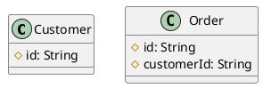
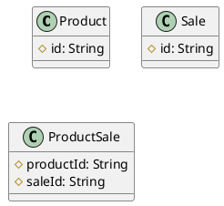

# Database

## Relational

#### One-to-Many Relationship

Let's say we have two entities: `Customer` and `Order`.
A customer can have many orders, but an order belongs to only one customer.
We can represent this relationship using a foreign key in the `Order` entity that references the `Customer` entity.



This allows us to make queries like to find all orders for a specific customer:

```sql
SELECT * FROM Order WHERE customer = 'some-customer-id';
```

#### Many-to-Many Relationship

Let's say we have a `Product` and a `Sale` entity. 
A product can be part of many sales, and a sale can include many products. 
This is a classic many-to-many relationship.
We can represent this relationship using a junction table called `ProductSale`.



This allows us to make queries like to find all sales that include a specific product:

```sql
SELECT saleId FROM ProductSale WHERE productId = 'some-product-id';
```
