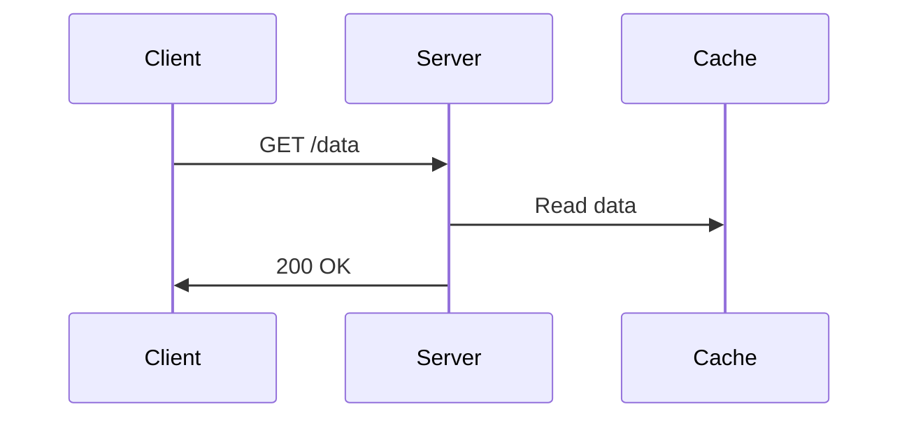
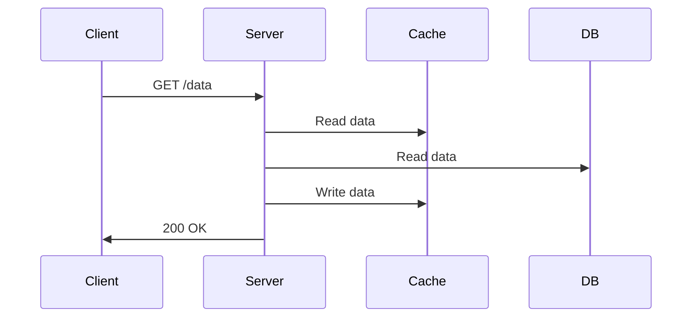
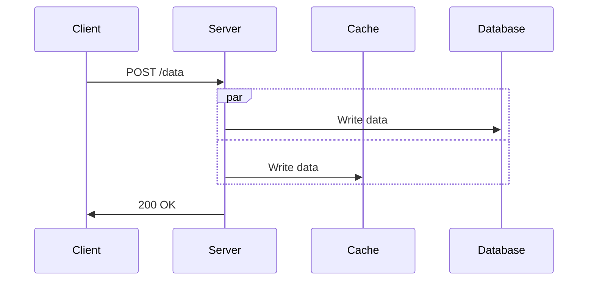
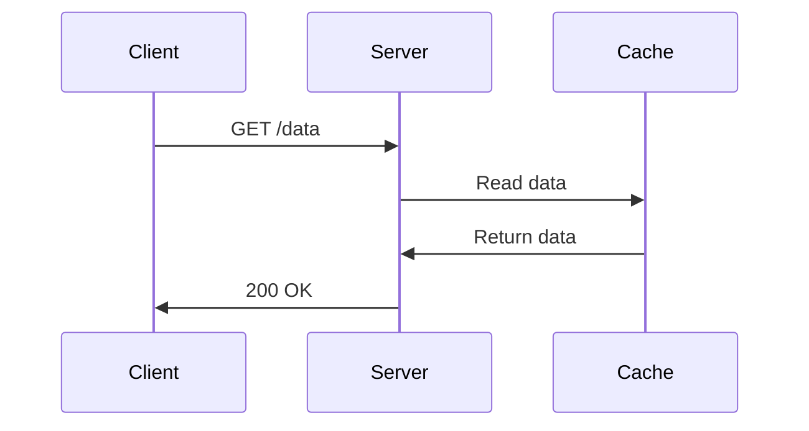
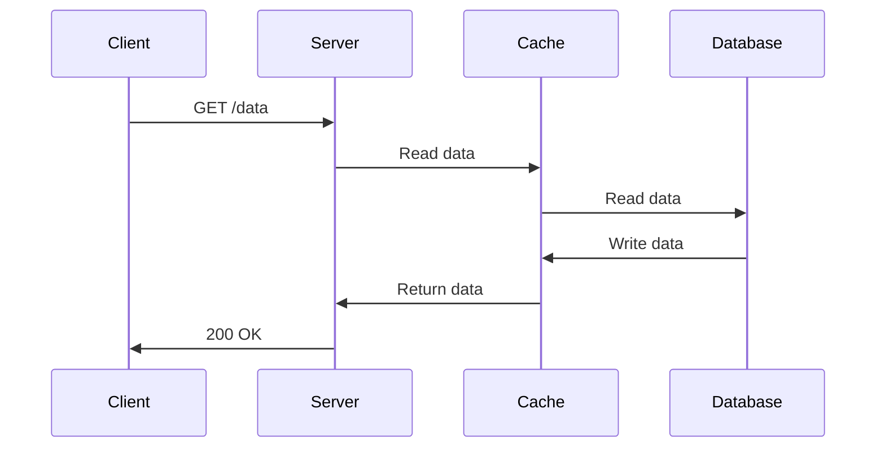
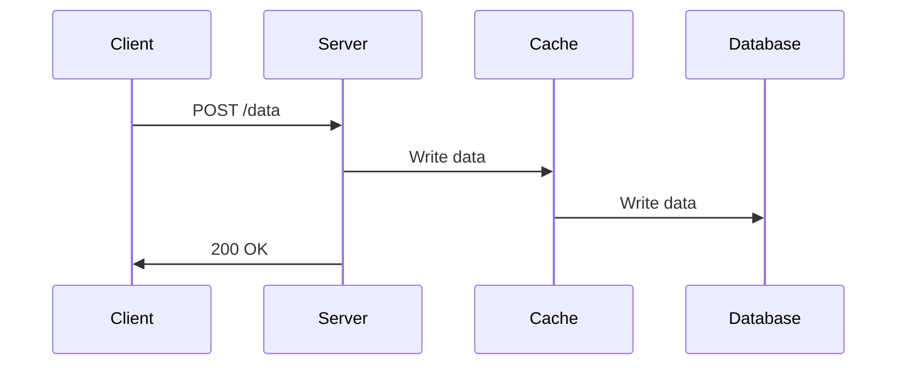
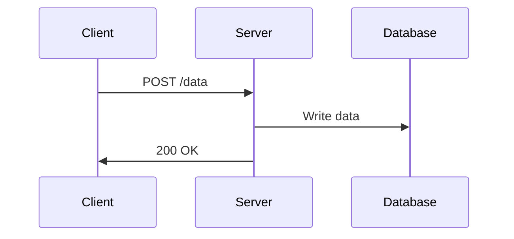
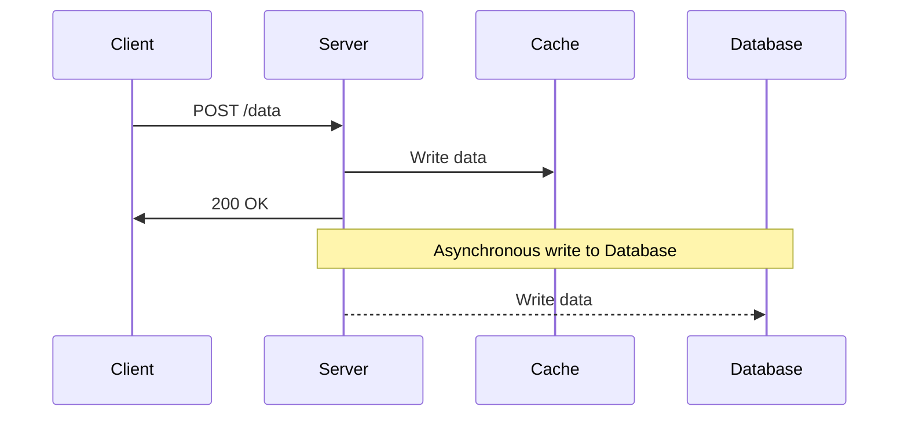

# Cache

[TOC]

[Caches](https://en.wikipedia.org/wiki/Cache_(computing)) store data so that future requests for that data can be served faster.
It is typically a smaller, faster storage layer that sits between the application and a larger, slower backing store (e.g., a database or file system).

## Cache-Aside

The application is responsible for reading and writing data to the cache as needed. 
When data is requested, the application first checks the cache. If the data is found (a cache hit), it is returned to the client.

#### Cache Hit

When the data is found in the cache, it is returned directly to the client.

#### Cache Miss

When the data is not found in the cache, it is fetched from the backing store, written to the cache, and then returned to the client.

#### Write

When data is written, it is written to both the cache and the backing store.

## Cache-Through (Read/Write-Through)

Instead of the application managing the cache, a caching layer (e.g., Redis, Memcached) is used to automatically handle reading and writing data to the cache as needed.

#### Cache Hit

When the data is found in the cache, it is returned directly to the client.

#### Cache Miss

When the data is not found in the cache, it is fetched from the backing store, written to the cache, and then returned to the client.

#### Write

Data is written to the cache and backing store at the same time. I/O completion is only confirmed once data has been written to both places.

## Write-Around

Data is written directly to the backing store, bypassing the cache. The cache is only updated when data is read.

## Write-Behind

Data is written to the cache only. The cache asynchronously writes data to the backing store at a later time.

## Eviction

TTL (Time-To-Live) is a common eviction policy where cached data is automatically removed after a certain period of time.
Other eviction policies include LRU (Least Recently Used), LFU (Least Frequently Used), and FIFO (First In, First Out).

## Examples

#### Redis (In-Memory Data Store)

[Redis](https://redis.io/) is a versatile in-memory data store that serves as both a cache and a database. 
It supports complex data structures and provides features like data expiration, which makes it a powerful choice for caching. Redis is often used to cache frequently accessed data, such as user sessions, leaderboard rankings, and real-time analytics.

[Memcached](https://memcached.org/) is an in-memory key-value store designed for high-performance caching. It is known for its simplicity and efficiency in storing and retrieving data.
Developers often use Memcached to cache database query results, API responses, and frequently accessed data in web applications.

## Sources
- [A Hitchhiker's Guide to Caching Patterns by Hazelcast](https://hazelcast.com/blog/a-hitchhikers-guide-to-caching-patterns/)
- [What is Read-Through vs Write-Through Cache? by Design Gurus](https://www.designgurus.io/answers/detail/what-is-read-through-vs-write-through-cache)
- [Mastering Caching: Strategies, Benefits and Trade-offs by Level Up Coding](https://levelup.gitconnected.com/mastering-caching-strategies-benefits-and-trade-offs-38c355024bc5)
